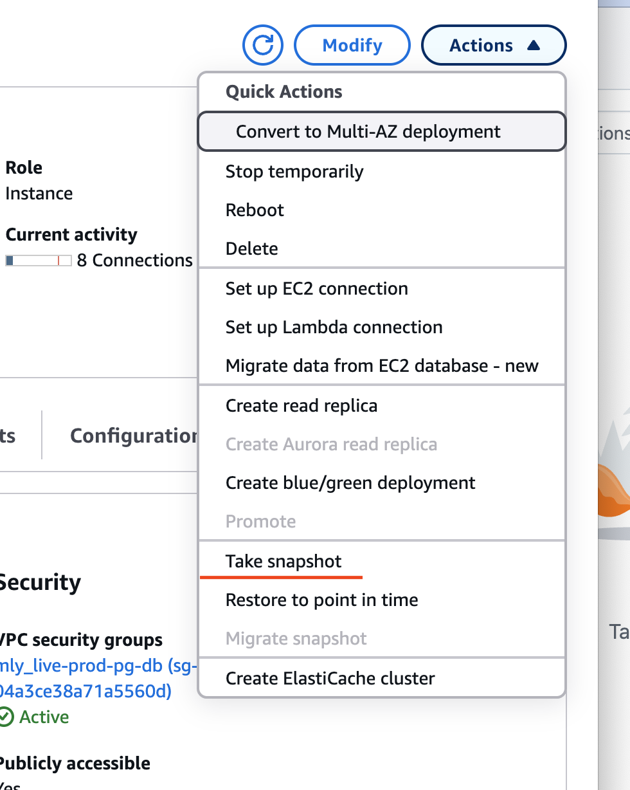

# Supabase Docker on EC2 with RDS
WARNING - DO NOT USE THIS ON PRODUCTION DATABASE 
there are scripts here that may break EVERYTHING



Im not 100% flat on all the permissions/tables /triggers/extensions.
PLEASE perform a snapshot - and instead of running format_db (breaks stuff) do a restore from point in time - (this depends on running the snapshot)


use the rds_snapshot_manager.sh to create a clean restore point to roll back 
```shell
aws iam put-role-policy \
  --role-name multi-user-ssh-access-role \
  --policy-name RDSSnapshotAccess \
  --policy-document '{
    "Version": "2012-10-17",
    "Statement": [
      {
        "Effect": "Allow",
        "Action": [
          "rds:CreateDBSnapshot",
          "rds:DeleteDBSnapshot",
          "rds:DescribeDBSnapshots", 
          "rds:DescribeDBInstances",
          "rds:RestoreDBInstanceFromDBSnapshot"
        ],
        "Resource": "*"
      }
    ]
  }'
```


the gist
I boot up the supabase docker containers - this runs all the migration scripts succesfully across containers. I run an export 

```shell
docker exec -t supabase-db pg_dump -U postgres --schema-only --no-owner --no-privileges postgres > schema.sql


docker exec -t supabase-db pg_dump -U postgres --data-only --no-owner --no-privileges postgres > data.sql

docker exec supabase-db pg_dumpall -U postgres --roles-only > roles.sql
```

N.B. - the vanilla postgres db schema is 170kb
I do some processing and end up with updated rds_schema.sql ~ 20kb
so we lost a bunch of extensions / webhooks (pg_net dependent)  and stuff..

# IMPORT RDS SCHEMA


## replace mlypg_admin -> to your master rds_admin / aws account 
```shell
psql "postgresql://${POSTGRES_USER}:${POSTGRES_PASSWORD}@${POSTGRES_HOST}:${POSTGRES_PORT}/postgres" -f postgres_users.sql
psql "postgresql://${POSTGRES_USER}:${POSTGRES_PASSWORD}@${POSTGRES_HOST}:${POSTGRES_PORT}/postgres" -f rds_schema.sql
psql "postgresql://${POSTGRES_USER}:${POSTGRES_PASSWORD}@${POSTGRES_HOST}:${POSTGRES_PORT}/postgres" -f data.sql
```

# TODO - also need these for auth - this has a potential jwt replacement extension - not tested
https://github.com/johndpope/rds-supabase/blob/main/docker/bootstrap_db.sh#L31


clone these into auth + realtime repos into docker folder 

```shell
cd docker
gh repo clone johndpope/auth
gh repo clone johndpope/realtime
docker-compose up
```


##  Format DB
To completely destroy the tables / roles etc - you can run format_db.sh
I use this to achieve golden path - but it's sql is not as clean as git reset....
sometimes need to run the script twice...


## KNOWN ISSUES

in the data.sql dump from docker /postgres / supabase - 
this line introduces the "db" host - i rip this out - but maybe need to put the rds aws host back in...
https://github.com/supabase/supabase/issues/27153

```sql
 _realtime.extensions (id, type, settings, tenant_external_id, inserted_at, updated_at) FROM stdin;
-- 580688be-be75-4157-b600-14ad10fc93c4	postgres_cdc_rls	{"region": "us-east-1", "db_host": "QhixI0o7PYIABziLUL4f0A==", "db_name": "sWBpZNdjggEPTQVlI52Zfw==", "db_port": "+enMDFi1J/3IrrquHHwUmA==", "db_user": "uxbEq/zz8DXVD53TOI1zmw==", "slot_name": "supabase_realtime_replication_slot", "db_password": "eGxa2ZKVreSn7eWieRQdp74vN25K+qFgdnxmDCKe4p20+C0410WXonzXTEj9CgYx", "publication": "supabase_realtime", "ssl_enforced": false, "poll_interval_ms": 100, "poll_max_changes": 100, "poll_max_record_bytes": 1048576}	realtime-dev	2025-03-11 05:45:03	2025-03-11 05:45:03
```

